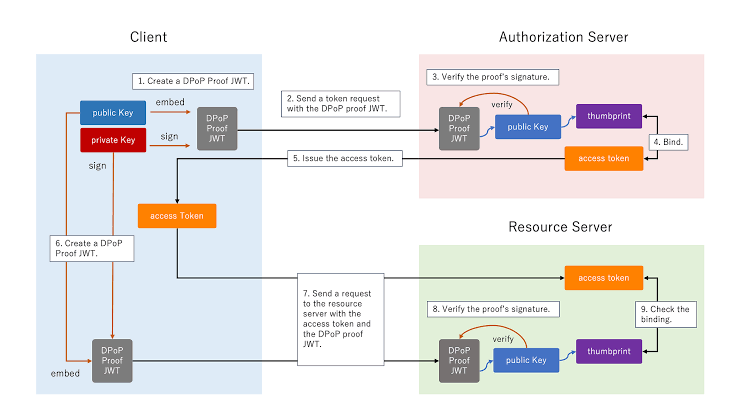

# crypto-trading-platform
A backend for managed crypto trading, built on **Scala 3**, **Cats Effect 3**, **http4s
(Ember)**, **skunk**, **Flyway**, and **[Iron](https://github.com/iltotore/iron)** refined
types.

Investors deposit funds and allocate them to pre-configured strategies; admins assemble
strategies from super-admin-authored components; the platform routes orders to Kraken/Binance
and (optionally) custodies crypto via Fireblocks. Balances are tracked with a double-entry
ledger, and every value crossing a boundary is a refined type so malformed data fails fast.

---

## Architecture

Single sbt module, source under `src/main/scala/trading/`, split by bounded context:

| Package | Responsibility |
|---|---|
| `domain` | Refined value types (`money`, `addresses`, `ids`), enums, and aggregates (`User`, `Order`, `Strategy`, `Account`). No effects. |
| `persistence` | skunk repositories + the single `Codecs` object. Flyway migrations live in `resources/db/migrations`. |
| `auth` | OIDC bearer-token verification (JWKS, RS256/384/512) and role guards. |
| `accounts` | Double-entry ledger service (deposit / withdraw / reserve / release / balance). |
| `instruments`, `strategies`, `orders` | Core trading services. |
| `exchanges` | `ExchangeClient` interface + Kraken / Binance adapters + an in-memory `MockExchange`. |
| `custody` | Fireblocks adapter (interface wired; signing stubbed). |
| `api` | `HealthRoutes` (root) + `client` and `admin` http4s routers. |
| `app` | `Main` (resource wiring) and `AppConfig` (pureconfig). |

Two HTTP servers run side by side: the **client API** on `:8080` (`/api/v1`) and the
**admin API** on `:8081` (`/admin/v1`). Both also expose `/health` and `/ready`.

---

## Design notes

### Iron `RefinedType` everywhere
Every money amount, price, quantity, percentage, fee, currency code, wallet address, email,
symbol, and identifier is a refined new type defined with Iron's `RefinedType` pattern:

```scala
type Amount = Amount.T
object Amount extends RefinedType[BigDecimal, Greater[0] | StrictEqual[0]]

type Symbol = Symbol.T
object Symbol extends RefinedType[String, Match["^[A-Z0-9]{2,10}/[A-Z0-9]{2,10}$"]]
```

This gives, for free, the companion API used throughout the codebase:

- `Amount.either(x): Either[String, Amount]` — validated; surfaced as HTTP 400 at the edge.
- `Amount.applyUnsafe(x)` — trusted construction (e.g. literals).
- `Amount.assume(x)` — no-check cast for values already proven valid (e.g. DB reads behind a CHECK constraint).
- `x.value` — unwrap to the base type.

Refinement happens at **two boundaries**:
- **HTTP/JSON** — `JsonCodecs` decoders call `.either`, turning a bad body into a 400.
- **skunk** — codecs re-refine on read (`eimap`), so a corrupt row throws a clear error rather than poisoning downstream logic. Postgres `CHECK` constraints back this up.

### Double-entry ledger
User balances are *derived*, never stored as a column. Every transfer is a debit/credit pair
written inside one transaction; available balance for `(account, currency)` is
`SUM(credit) - SUM(debit)`. This is auditable and makes refunds/reversals trivial.

### Auth
`Authorization: Bearer <jwt>` → read `kid` from the header → fetch the matching JWKS key →
verify **signature + expiry + issuer + audience**. Issuer and audience are checked against
`auth.issuer` / `auth.audience` (RFC 7519 `aud` may be a string or array). Claims → `Principal`
mapping (DB lookup + first-login provisioning) is injected, keeping `auth` free of persistence.

### Order lifecycle
`place` → persist `Pending` → submit to venue → `Submitted` (or `Rejected`). `reconcile`
pulls fills and advances `PartiallyFilled`/`Filled`. State is persisted via a single 17-column
`orderCodec`; status transitions are scoped UPDATEs.

---

## Running locally

```bash
# 1. Postgres + Keycloak
docker compose up -d postgres keycloak

# 2. Run (defaults target localhost; uses the in-memory Mock exchange)
sbt run

# 3. Liveness / readiness
curl localhost:8080/health   # {"status":"ok"}
curl localhost:8080/ready    # {"status":"ready"}  (503 if Postgres is down)

# 4. Get a token (Keycloak direct-grant) and call the API
TOKEN=$(curl -s -X POST \
  http://localhost:8082/realms/trading/protocol/openid-connect/token \
  -d grant_type=password -d client_id=trading-app -d client_secret=dev-secret \
  -d username=bob -d password=bob | jq -r .access_token)

curl -H "Authorization: Bearer $TOKEN" http://localhost:8080/api/v1/instruments
```

Flyway applies `V001__init.sql` on boot.

### Configuration

All config lives in `src/main/resources/application.conf` with localhost defaults and env
overrides (twelve-factor). Key variables (see `.env.example` for the full list):

| Env | Default | Meaning |
|---|---|---|
| `PG_HOST` / `PG_PORT` / `PG_USER` / `PG_PASSWORD` / `PG_DB` | localhost:5432 trading | Postgres connection |
| `PG_POOL_SIZE` | 16 | skunk session pool size |
| `PUBLIC_HTTP_PORT` / `ADMIN_HTTP_PORT` | 8080 / 8081 | server ports |
| `OIDC_ISSUER` / `OIDC_AUDIENCE` / `OIDC_JWKS_URI` | Keycloak `trading` realm | token validation (enforced) |
| `EXCHANGES_LIVE` | `false` | `true` routes to real Kraken/Binance instead of the mock |
| `KRAKEN_*` / `BINANCE_*` / `FIREBLOCKS_*` | empty | external credentials |

## Build & test

```bash
sbt compile      # zero warnings, zero errors
sbt run          # boots both servers
sbt stage        # runnable artifact under target/universal/stage/
```

Rule of thumb with the `RefinedType` companions: `apply` is `compile-time` only (literals); for runtime values use .`applyUnsafe` (trusted, throws on bad input), .`either/.option` (validated), or `.assume` (no check)
```scala
type TradeId = TradeId.T                          // Type alias
object TradeId extends RefinedType[UUID, True]    // Refinement definition
```
What it does:
`RefinedType[UUID, True]` creates a refinement wrapper around UUID
`TradeId.T` is the refined type itself
The type alias makes `TradeId`convenient shorthand for `TradeId.T`
`True` is the constraint (here: no additional validation, always valid)
Why use it:

`Prevents accidentally mixing different UUID-based IDs at compile time`:
```scala
val tradeId: TradeId = TradeId(someUUID)      // ✓ OK
val orderId: OrderId = tradeId                 // ✗ Type error - can't mix them
```

## Conversion[-A, +B] — implicit conversions
The replacement for Scala 2's implicit def. Must be an explicit given/import, so conversions are opt-in and traceable.
```scala
given Conversion[String, Int] = Integer.parseInt(_)
val x: Int = "123"  // uses the conversion
```
Use case: safe, discoverable implicit coercion (e.g. wrapping APIs, numeric widening).
```scala
import sbt.*
import scala.language.implicitConversions
case class AgentModule(name: String, module: ModuleID, scope: AgentScope, arguments: String)

object AgentModule {
  given Conversion[ModuleID, AgentModule] with
    def apply(module: ModuleID): AgentModule = JavaAgent(module)
}
```
`Conversion[ModuleID, AgentModule]` lets sbt's `ModuleID` be used anywhere an `AgentModule` is expected, automatically wrapping it via `JavaAgent(module)`

The compiler will insert `JavaAgent(...)` for you when it finds a `ModuleID` where an `AgentModule` is needed.

Many type classes are parameterized by a type constructor F[_] (one hole). But lots of useful types have two parameters and you need to "fix" one:
```scala
trait Functor[F[_]]:
  def map[A, B](fa: F[A])(f: A => B): F[B]
```  
Either takes two type params: `Either[E, A]`. To make a `Functor` for `Either`, you must fix the error type `E` and leave the value type as the hole. You need something of kind `* -> *` from a `* -> * -> *`.

Without the flag (native Scala 3 type lambda)
```scala
given [E]: Functor[[A] =>> Either[E, A]] with
  def map[A, B](fa: Either[E, A])(f: A => B) = fa.map(f)
```  
That `[A] =>> Either[E, A]` is a type lambda — correct, but noisy, especially nested.

With `-Ykind-projector`

```scala
given [E]: Functor[Either[E, *]] with
  def map[A, B](fa: Either[E, A])(f: A => B) = fa.map(f)
```  
`Either[E, *]` means "Either[E, _] with the second slot left open" — it desugars to exactly the type lambda above. The `*` marks the hole.




